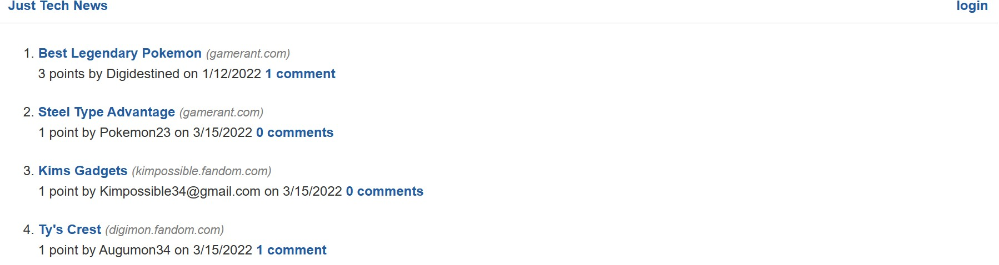

# Title
Just Tech News

# Application Description
The module had us build an application where people can post different news articles. This application functions as a blog
where users can post different articles they find interesting or cool. The application also allows the users to click
on an article and leave comments on the article along with being able to see how many comments are on each article. Users
can also see who posted the articles and have the option of updating their posts or comments

# Running The Application
The first step in running this application is to make sure the computer has the necessary software to run the application. The software the computer needs is Visual Studio Code, an internet browser like Google Chrome, and Node.js. The links to download these applications is provided below.
- <a href="https://code.visualstudio.com/docs/setup/setup-overview">Visual Studio Code Download</a>
- <a href="https://nodejs.org/en/">Node.js Download</a>
- <a href="https://www.google.com/chrome/">Google Chrome Download</a>

After visual studio code is done downloading the link to the source code needs to be downloaded from my github respository. The link to my github repository is provided down below.
- <a href="https://github.com/Joker282855/blogger-tech">Github Repository</a>
Click on the green code button in the top right corner to get the link and choose the https option. Open a terminal in visual studio code after copying the link for the source code and type the command git clone. Double click after typing git clone to put in the link for the source code and hit enter to download it. 

To get the code working with visual studio code some packages from the Node.js library need to be installed. The packages are installed by typing the command npm i inside the visual studio code terminal. After the packages are done installing typing the command npm start will connect the server to our application and let us view the application on the web. The link for the application after npm start is entered is http://localhost:3001.

# Module Tasks
1. As a user I can log in and post an article
2. As a user I can post new articles
3. As a user I can click on an article and comment on it
4. As a user I can update a comment or article I posted

# Tasks Achieved By 
The tasks were achieved by following the lessons in the module for week 14 of the bootcamp.

# Viewing Applicaiton
To view this application you need to follow the steps listed in the running the application section that talks about installing Visual Studio Code and copying 
the repository. After cloning the repository simply use the command npm start and type http://lcoalhost:3001 to pull up the application on your browser

# Screenshot of Application

# Contributors
Josh Jackson